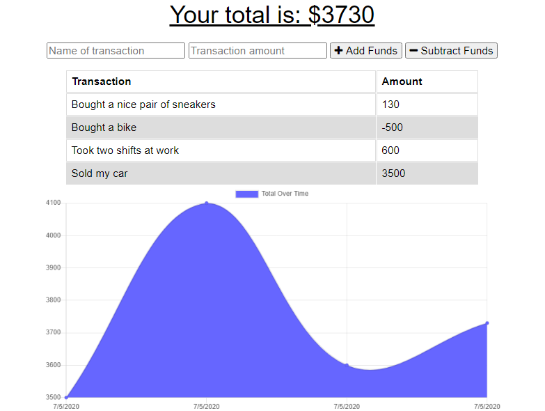

BUDGET TRACKER

  
Budget Tracker is an app that can help users track their budget. This was for a project for a coding bootcamp that involved building a service worker and local cache to save local data when offline to later send to the db when the app reconnceted to the internet. The app makes an easily readible line graph to track spending over time. 

Link to deployed application: https://calm-caverns-42336.herokuapp.com/
Link to GitHub repo: https://github.com/dooski/budget-tracker

